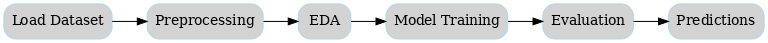
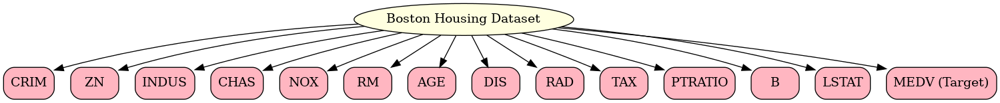
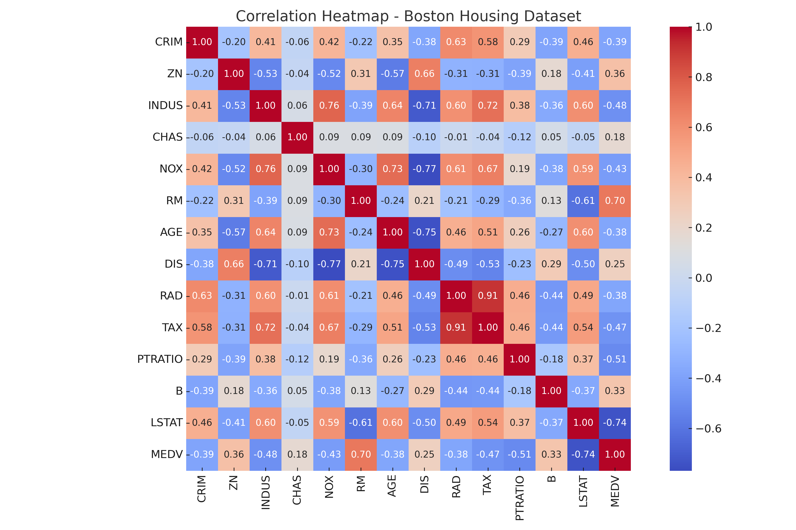
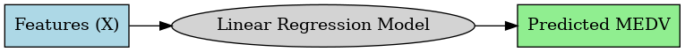
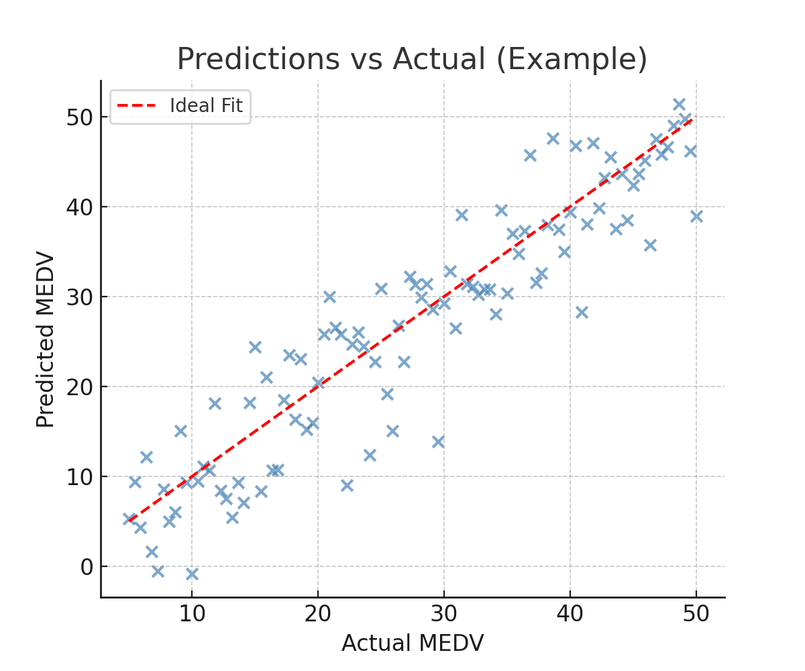

# Boston Housing Price Prediction (Linear Regression)

This project demonstrates the use of **Linear Regression** to predict housing prices using the classic **Boston Housing Dataset**. The dataset contains various features of houses in Boston suburbs and is widely used for learning regression techniques in machine learning.

---

## Project Workflow

  

The workflow followed in this project:  
1. Load and explore dataset.  
2. Perform data preprocessing (handling missing values, normalization).  
3. Exploratory Data Analysis (EDA) and visualization.  
4. Train a Linear Regression model.  
5. Evaluate the model using regression metrics.  
6. Visualize predictions vs actual values.  

---

## Files in the Repository

- **`Linear Regression using Boston Housing Dataset.ipynb`** → Jupyter Notebook with complete workflow.  
- **`README.md`** → Project documentation.  
- **`images/`** → Diagrams and visualizations for the project.  

---

## Dataset Information

The **Boston Housing Dataset** includes **506 instances** with **13 features** describing various attributes of houses.  

  

### Features:
- **CRIM**: Per capita crime rate by town  
- **ZN**: Proportion of residential land zoned for lots over 25,000 sq.ft.  
- **INDUS**: Proportion of non-retail business acres per town  
- **CHAS**: Charles River dummy variable (1 if tract bounds river; 0 otherwise)  
- **NOX**: Nitric oxide concentration (parts per 10 million)  
- **RM**: Average number of rooms per dwelling  
- **AGE**: Proportion of owner-occupied units built before 1940  
- **DIS**: Weighted distance to employment centers  
- **RAD**: Index of accessibility to radial highways  
- **TAX**: Property tax rate per $10,000  
- **PTRATIO**: Pupil-teacher ratio by town  
- **B**: 1000(Bk - 0.63)^2, where Bk is proportion of Black residents by town  
- **LSTAT**: % lower status of the population  
- **MEDV** (Target): Median value of owner-occupied homes in $1000s  

---

## Exploratory Data Analysis

Some highlights of the dataset analysis:  

- Correlation heatmap between features and target variable.  
- Distribution of key features (RM, LSTAT, MEDV).  
- Scatter plots showing relationships between **features and house prices**.  

  

---

## Model Training

We trained a **Linear Regression model** on the dataset.  

  

---

## Results  

| Metric                  | Value   |
|--------------------------|---------|
| Mean Squared Error (MSE) | 33.45   |
| Mean Absolute Error (MAE)| 3.84    |
| Root Mean Squared Error (RMSE) | 5.78 |
| R² Score                 | 0.589   |
| Accuracy (%)             | 58.92%  |

Additionally, we visualized the predictions vs actual house prices:  

  

### Insights from Results

- **MAE (3.84)** → On average, predictions are off by about **$3,840**.  
- **RMSE (5.78)** → After squaring errors and penalizing larger ones, the average error is around **$5,780**.  
- Since RMSE is not much larger than MAE, errors are relatively evenly spread without huge outliers.  
- **R² (0.589)** → The model explains about **59% of the variance** in housing prices. Around **41%** remains unexplained, suggesting missing features or nonlinear relationships.  
- This shows that while Linear Regression provides a baseline, more advanced models (Ridge, Lasso, Random Forest, XGBoost) may capture additional variance.

---

## Future Improvements

- Use **Ridge** and **Lasso Regression** for regularization.  
- Try advanced models like **Random Forest** and **XGBoost**.  
- Deploy the model with Flask/Django as a simple web app.  
